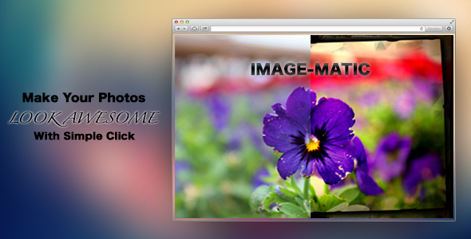

Image-Matic
===========

Make Your Photos Look Awesome
-----------------------------



### Live Demo

[View Demo](http://effect.gq/)

### Requirements and Features

* * * * *

Requirements
============


-   Apache or Nginx Webserver
-   PHP 5.3.8+
-   PHP GD Libraries
-   At least 128MB Memory on the Server


Features
========


-   Bootstrap 3
-   Mobile first, Responsive Design
-   Custom Social buttons integration
-   Full javascript based video search on Youtube API
-   Lots of Photo filters
-   No Database is required

### Configuration

* * * * *

You can start with application configuration before uploading to your
web server,

open up **config.php **and on line 8 replace Application name

```php
'Title' => "Image-Matic",
```

so it looks like this:

```php
'Title' => "Your New Title",
```

you can change Meta keyword and Meta Description same way:

```php
"Meta-Description" => "Make Your Photos Look Awesome",

"Meta-Keywords" => "Photo Editing, Photo filters, Photo Effects, Awesome Photos",
```


you will see also two other patameters:

```php
'TimeToKeepUploadedImage' => 60*60,
```

and

```php
'TimeToKeepSharedImage' => 60*60*24*30,
```

**TimeToKeepUploadedImage**indicates when uploaded image should be
removed from server, value is given in seconds 

**TimeToKeepSharedImage **indicates when shared image should be removed
from server, value is given in seconds

### Recommended Hosting

* * * * *

Since application system resource usage is high we recommend VPS
hosting.

You can get VPS hosting on
[DigitalOcean](https://www.digitalocean.com/?refcode=2cec31bfb429) as
cheap as \$5 per month.


### Installation

* * * * *

Assuming you have already made changes in configuration file,
now, you will have to give application persmission to write into directories. (chmod 777)

Directories that needs to be writable are: 

 

```sh
/upload/files/large
/upload/files/thumb
/share/files
```

now you can navigate to you website to check. open up
http://youdomain.com/check.php file which will run a test for you, if
you see errors please follow the instructions, otherwise you can delete
check.php file and enjoy your new website.

-------
Have fun
